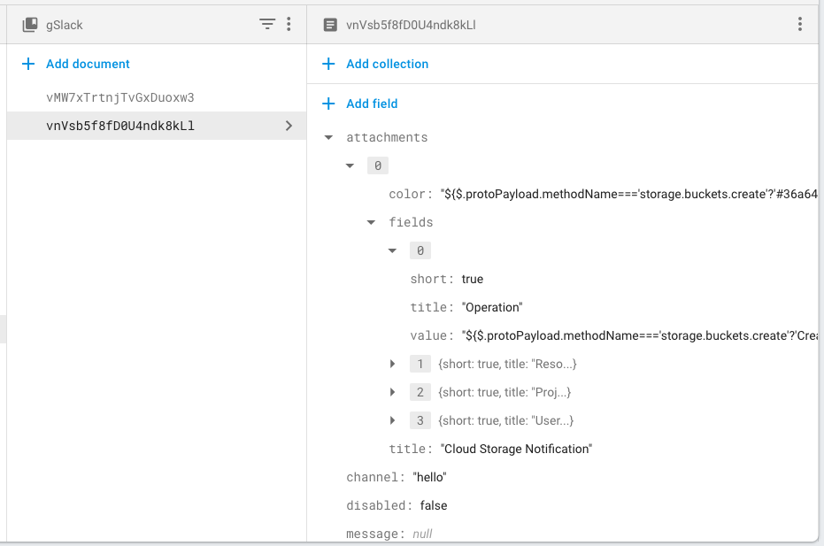
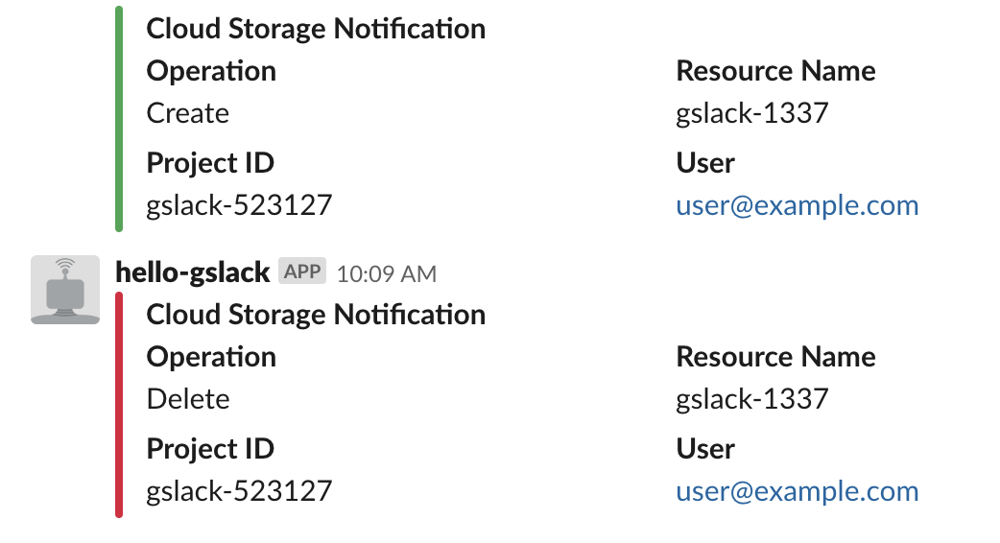

# gSlack

## Prerequisites

- Have a Google Cloud Platform project with billing & Cloud Build API enabled
- Have access to a user with `Owner` role on the project
- Have `gcloud` SDK and CLI installed on your machine ([quickstart](https://cloud.google.com/sdk/docs/quickstarts))
- Have [`firebase-tools`](https://firebase.google.com/docs/cli/) CLI installed on your machine

## Generate Slack API Token

- Go to [https://<YOUR_SLACK_TEAM>.slack.com/apps/new/A0F7YS25R-bots]()
- Enter a name for the bot to post with. (i.e. gcp-alert-service)
- Click `Add bot integration`.
- Wait until the UI displays the `API Token` and copy the string (i.e. xxxx-yyyyyyyyyyyy-zzzzzzzzzzzzzzzzzzzzzzzz)

## Initialize Firebase environment

- Make sure you are logged in with your `firebase` CLI tool.
- Edit `<YOUR_PROJECT_ID>` in [`.firebaserc`](.firebaserc) with your real project ID.
- Run `$ firebase functions:config:set gslack.api_token="xxxx-yyyyyyyyyyyy-zzzzzzzzzzzzzzzzzzzzzzzz"` (Replace with your slack API token)

## Deployment

- Make sure your `gcloud` SDK and CLI environment is authenticated against the requested GCP project with a user that has Owner permissions.
- Run `$ make create-export PROJECT=<YOUR_PROJECT_ID>` - Replace `<YOUR_PROJECT_ID>` with your project ID (Run once on the first deployment).
- Deploy the function, run: `$ yarn deploy` or `$ npm run deploy` from the [functions](functions) dir.

## Firestore configuration

- Navigate to your project's Firestore console.
- Create a new collection named `"gSlack"` in Firestore.
- Add documents to the new collection with the following schema:

| Field Name | Type | Description |
| ------------- | ------------- | ------------- |
| channel | string | The destination slack channel, i.e. `general` or `@username` for private messages |
| disabled | bool | Whether the rule is disabled; disabled rules will not be evaluated by the function |
| test | string | Must be a a valid JS expression that returns a boolean. If it returns true the test passes. e.g. `$.protoPayload.serviceName==='cloudfunctions.googleapis.com'` |
| message | string | Must be a a valid JS string template. It will be evaluated to produce the message. e.g. `This is the logname: ${$.logName}` |

- Each document is a rule that will be evaluted by the function and will be posted to the corresponding slack channel if the evaluated test expression passes as `true`.
- If you want to temporary disable a rule, simply update the `disabled` field to `true`.

## Function Message Payload Example

The information received by the function for the log entry is something like this:

```
{
 protoPayload: {
  @type:  "type.googleapis.com/google.cloud.audit.AuditLog"
  status: {
  }
  authenticationInfo: {
   principalEmail:  "...@doit-intl.com"
  }
  requestMetadata: {
   callerIp:  "..."
   callerSuppliedUserAgent:  "Mozilla/5.0 (Macintosh; Intel Mac OS X 10_12_0) AppleWebKit/537.36 (KHTML, like Gecko) Chrome/58.0.3029.110 Safari/537.36,gzip(gfe)"
  }
  serviceName:  "storage.googleapis.com"
  methodName:  "storage.buckets.create"
  authorizationInfo: [
   0: {
    permission:  "storage.buckets.create"
    granted:  true
   }
  ]
  resourceName:  "projects/_/buckets/bababab-vadim"
  serviceData: {
   @type:  "type.googleapis.com/google.iam.v1.logging.AuditData"
   policyDelta: {
    bindingDeltas: [
     0: {
      action:  "ADD"
      role:  "roles/storage.legacyBucketOwner"
      member:  "projectOwner:..."
     }
     1: {
      action:  "ADD"
      role:  "roles/storage.legacyBucketOwner"
      member:  "projectEditor:..."
     }
     2: {
      action:  "ADD"
      role:  "roles/storage.legacyBucketReader"
      member:  "projectViewer:..."
     }
    ]
   }
  }
  request: {
   defaultObjectAcl: {
    bindings: [
     0: {
      members: [
       0:  "projectOwner:..."
       1:  "projectEditor:..."
      ]
      role:  "roles/storage.legacyObjectOwner"
     }
     1: {
      members: [
       0:  "projectViewer:..."
      ]
      role:  "roles/storage.legacyObjectReader"
     }
    ]
    @type:  "type.googleapis.com/google.iam.v1.Policy"
   }
  }
 }
 insertId:  "552D5EE8A9ED9.A65A379.EF01047D"
 resource: {
  type:  "gcs_bucket"
  labels: {
   storage_class:  ""
   location:  "US-CENTRAL1"
   bucket_name:  "bababab-vadim"
   project_id:  "..."
  }
 }
 timestamp:  "2017-06-26T05:07:46.673Z"
 severity:  "NOTICE"
 logName:  "projects/.../logs/cloudaudit.googleapis.com%2Factivity"
 receiveTimestamp:  "2017-06-26T05:07:54.586745618Z"
}
```

## Fiestore Rules examples

### Google Cloud Storage Bucket Created/Deleted

* Display bucket name, created/deleted, location, project and by who.

* Document ID: `bucket-create-delete`:

* Document Fields:

    ```
        channel: "general",
        disabled: false,
        test: "$.protoPayload.serviceName==='storage.googleapis.com' && ( $.protoPayload.methodName==='storage.buckets.create' || $.protoPayload.methodName==='storage.buckets.delete')",
        message: "Bucket '${$.resource.labels.bucket_name}' was ${$.protoPayload.methodName==='storage.buckets.create'?'created':'deleted'} at location '${$.resource.labels.location}' by '${$.protoPayload.authenticationInfo.principalEmail}' in project '${$.resource.labels.project_id}'",
        attachments: null

    ```

* [Slack Message Formatting](https://api.slack.com/docs/message-formatting)

    Use the attachments field (type of array of maps) to add Slack message attachments instead of the default text message.

    One of 'message' or 'attachments' fields must not be null.

    ```
        channel: "general",
        disabled: false,
        test: "$.protoPayload.serviceName==='storage.googleapis.com' && ( $.protoPayload.methodName==='storage.buckets.create' || $.protoPayload.methodName==='storage.buckets.delete')",
        message: null,
        attachments: [
            {
                title: "Cloud Storage Notification",
                color: "${$.protoPayload.methodName==='storage.buckets.create'?'#36a64f':'#de1738'}",
                fields: [
                    {
                        short: true,
                        title: "Operation",
                        value: "${$.protoPayload.methodName==='storage.buckets.create'?'Create':'Delete'}"
                    },
                    {
                        short: true,
                        title: "Resource Name",
                        value: "${$.resource.labels.bucket_name}"
                    },
                    {
                        short: true,
                        title: "Project ID",
                        value: "${$.resource.labels.project_id}"
                    },
                    {
                        short: true,
                        title: "User",
                        value: "${$.protoPayload.authenticationInfo.principalEmail}"
                    },
                ]
            }
        ]
    ```

    
    


### Google Compute Engine Instance Started/Stopped

* Display instance name, started/stopped, zone, project and by who.

* Document ID: `gce-start-stop`:

* Document Fields:

    ```
        channel: "devops",
        disabled: false,
        test: "$.protoPayload.serviceName==='compute.googleapis.com' && ( $.protoPayload.methodName==='v1.compute.instances.start' || $.protoPayload.methodName==='v1.compute.instances.stop') && $.operation.last",
        message: "Instance '${$.protoPayload.resourceName.split('/').slice(-1)[0]}' was ${$.protoPayload.methodName==='v1.compute.instances.start'?'started':'stopped'} at zone '${$.resource.labels.zone}' by '${$.protoPayload.authenticationInfo.principalEmail}' in project '${$.resource.labels.project_id}'",
        attachments: null
    ```

### Google App Engine New Version Deployed

* Display project, module, version and by who.

* Document ID: `gae-new-version`:

* Document Fields:

    ```
        channel: "@user",
        disabled: false,
        test: "$.protoPayload.serviceName==='appengine.googleapis.com' && $.protoPayload.methodName==='google.appengine.v1.Versions.CreateVersion' && $.operation.last",
        message: "Google AppEngine version created with version ID '${$.resource.labels.version_id}' for module '${$.resource.labels.module_id}' by '${$.protoPayload.authenticationInfo.principalEmail}' in project '${$.resource.labels.project_id}'",
        attachments: null
    ```

